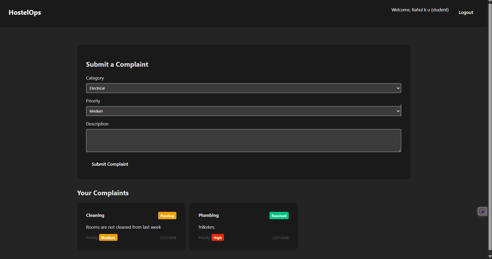
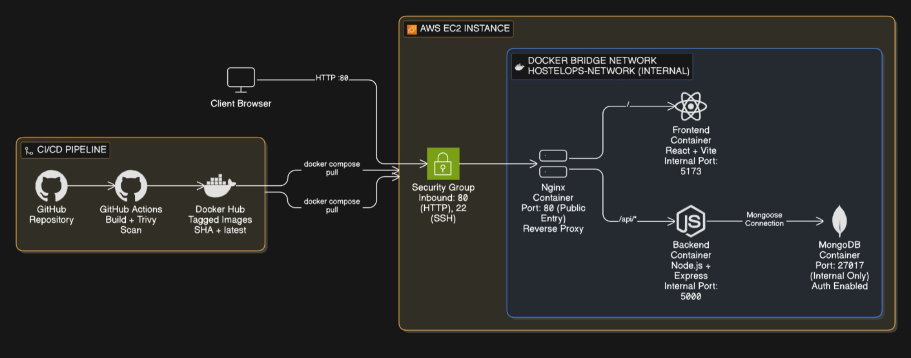
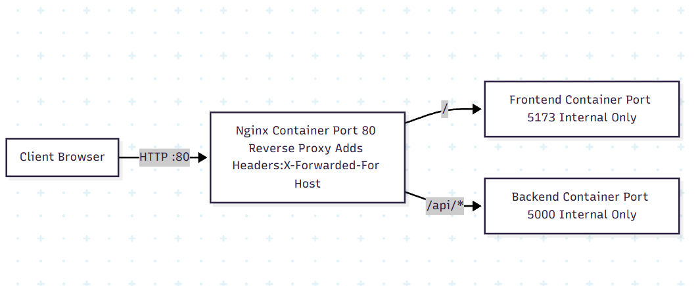
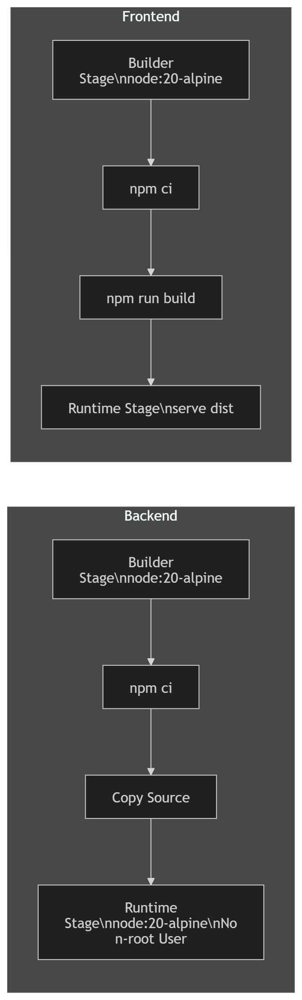
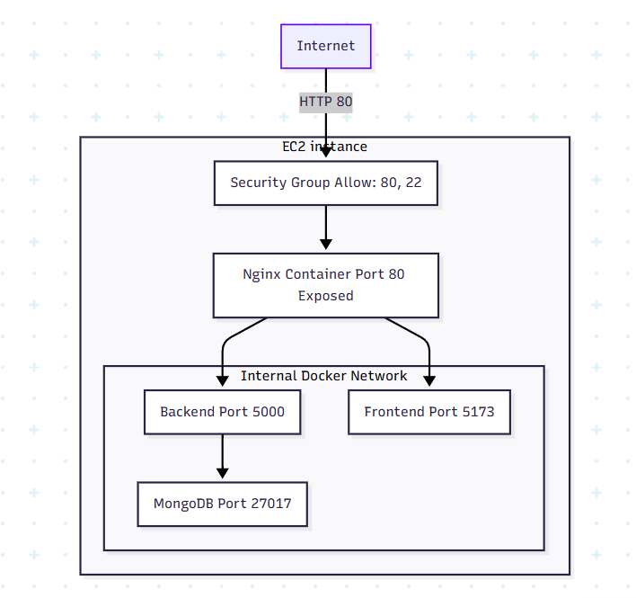
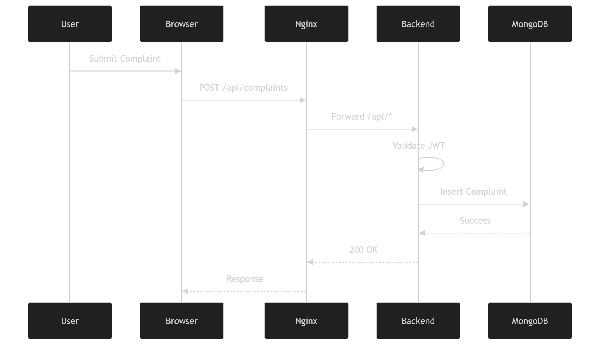

## HostelOps

Smart hostel complaint & maintenance management system.

A minimal, production-ready full‑stack app with a secure Dockerized architecture and CI/CD workflow.

### Features

- **Student portal**: register, log in, submit complaints, track status.
- **Admin dashboard**: view all complaints, filter, update status.
- **Authentication**: JWT-based login, protected routes.
- **Audit logging**: basic request logging and centralized error handling.

### Tech Stack

- **Frontend**: React + Vite (served via `serve` inside a Docker container).
- **Backend**: Node.js + Express.
- **Database**: MongoDB.
- **Reverse proxy**: Nginx (routes `/` → frontend, `/api/*` → backend).
- **Infra**: Docker & Docker Compose, GitHub Actions CI/CD, Trivy image scanning.

### Architecture & Request Flow

All app services live on an internal Docker bridge network behind Nginx.

- **Only exposed port**: `80` (HTTP) on the host/VM (plus SSH `22` for administration).
- **Internal ports**: backend (`5000`), frontend (`5173`), MongoDB (`27017`) are **not** published to the internet.
- **Request path**:  
  `Client → Host :80 → Nginx → (frontend container or backend container) → MongoDB`

This keeps the database unreachable from the public internet and centralizes traffic and TLS at Nginx.

### Local Development (Docker)

1. Make sure Docker Desktop (or Docker Engine) is installed and running.
2. From the project root (where `docker-compose.yml` lives), run:

   ```bash
   docker compose up --build -d
   ```

3. Open the app in your browser:
   - `http://localhost` (Nginx reverse proxy)

4. To stop everything:

   ```bash
   docker compose down
   ```


### Seeding an Admin User

After the stack is up, you can seed a default admin account in MongoDB:

```bash
docker exec -it hostelops-backend node seed/adminSeed.js
```

**Default admin credentials:**

- **Email**: `admin@hostelops.com`  
- **Password**: `adminpassword123`

### Environment Variables

Backend reads configuration from environment variables (`process.env`) and, in local Docker, from `backend/.env`:

- `PORT` – API port (default `5000`).
- `MONGODB_URI` – Mongo connection string (default `mongodb://mongodb:27017/hostelops` inside Docker).
- `JWT_SECRET` – secret used to sign JWTs.
- `FRONTEND_URL` – frontend origin used for CORS and links.

For production (VM deploy), these are passed via `docker-compose.hub.yml` and/or a host-level `.env` file.

### Production Deploy (VM + GitHub Actions)

This repo includes a GitHub Actions workflow at `.github/workflows/ci-cd.yml` that:

1. **On pull requests**:
   - Builds backend & frontend Docker images.
   - Scans both with **Trivy** and fails on any **CRITICAL** vulnerability.

2. **On push to `main`/`master`**:
   - Builds and scans images.
   - Pushes them to Docker Hub as:
     - `${DOCKERHUB_USERNAME}/hostelops-backend:{SHA,latest}`
     - `${DOCKERHUB_USERNAME}/hostelops-frontend:{SHA,latest}`
   - SSHes into your VM and runs:
     - `docker compose -f docker-compose.hub.yml pull`
     - `docker compose -f docker-compose.hub.yml up -d`

On the VM, `docker-compose.hub.yml` mirrors the local architecture but uses the published images and pins MongoDB to `mongo:8.0.19-noble` with a healthcheck so the backend only starts once the database is ready.

To use the provided CI/CD pipeline, configure the GitHub repo variables/secrets as described in `.github/workflows/ci-cd.yml` (`DOCKERHUB_USERNAME`, `DOCKERHUB_TOKEN`, `VM_HOST`, `VM_USER`, `VM_SSH_KEY`, `VM_APP_PATH`, etc.).

---

## Submission Documentation

> This section is structured to match the assignment rubric.  
> You can insert your own figures where the image placeholders are.

### 1. Running Deployed Application (Docker-based)

- **Local**:
  - Run `docker compose up --build -d` from the project root.
  - Open `http://localhost` in a browser (served via Nginx).
- **Production (VM)**:
  - GitHub Actions builds & scans Docker images, pushes to Docker Hub, SSHes into the VM, and runs:
    - `docker compose -f docker-compose.hub.yml pull`
    - `docker compose -f docker-compose.hub.yml up -d`
  - The app is then reachable at `http://<VM_PUBLIC_IP_OR_DOMAIN>`.

_Image placeholder (screenshots of running app):_

```md

```

### 2. Architecture Diagram (Containers + Reverse Proxy + Ports)

Logical architecture:

- **Client (Browser)** → HTTP `:80` → **Nginx container**
  - `/` → **frontend container** (React static build on port `5173`, internal only).
  - `/api/*` → **backend container** (Express API on port `5000`, internal only).
- **Backend** talks to **MongoDB container** on `27017` over the internal Docker bridge network (`hostelops-network`).
- MongoDB is never exposed outside Docker; only Nginx is published.

_Image placeholder (high-level container & port diagram):_

```md

```

### 3. Nginx Configuration Explanation

- **Reverse proxy**:
  - `location /`:
    - `proxy_pass http://frontend:5173;`
    - Forwards all root-path traffic to the frontend service.
  - `location /api/`:
    - `proxy_pass http://backend:5000/api/;`
    - Forwards all API traffic to the backend service.
- **Headers & WebSockets**:
  - Sets `Host`, `X-Real-IP`, `X-Forwarded-For`, `X-Forwarded-Proto` to preserve client info.
  - Enables `Upgrade` / `Connection` headers for WebSocket compatibility.
- **Security**:
  - Only Nginx listens on port `80`; other containers are not directly accessible from the internet.

_Image placeholder (annotated Nginx flow):_

```md

```

### 4. Dockerfiles and Containers Explanation

- **Backend Dockerfile**:
  - Multi-stage build using `node:20-alpine`.
  - **Builder stage**:
    - Installs patched OpenSSL libs (`libcrypto3`, `libssl3`) to satisfy Trivy.
    - Runs `npm ci --omit=dev` for reproducible, production-only dependencies.
    - Copies source code.
  - **Runtime stage**:
    - Uses `node:20-alpine` again, upgrades OpenSSL libs.
    - Creates non-root `appuser` and copies built app.
    - Exposes port `5000` and starts `server.js`.
- **Frontend Dockerfile**:
  - Builder stage (React + Vite):
    - Runs `npm ci` and `npm run build`.
  - Runtime stage:
    - Uses `node:20-alpine`, upgrades OpenSSL libs.
    - Installs `serve` globally.
    - Serves the static `dist` build on port `5173`.
- **MongoDB**:
  - Uses `mongo:8.0.19-noble`.
  - Has a `healthcheck` using `mongosh` to ensure readiness before backend starts.

_Image placeholder (Docker build pipeline / stages):_

```md

```

### 5. Networking & Firewall Strategy

- **Docker network**:
  - All services share the internal `hostelops-network` (bridge).
  - Only Nginx is bound to the host (port `80`).
- **Host/Cloud firewall**:
  - Inbound rules: allow `80` (HTTP) and `22` (SSH) only.
  - Deny all direct access to `5000`, `5173`, and `27017`.
- **Security rationale**:
  - Attack surface is minimized to a single entry point (Nginx).
  - MongoDB is fully shielded from external scanning and brute-force attacks.

_Image placeholder (network & firewall view):_

```md

```

### 6. Request Lifecycle Explanation

Example: student submits a complaint from the UI.

1. **Browser** sends `POST /api/complaints` with JWT in `Authorization` header to `http://<host>/api/complaints`.
2. **Nginx** receives the request on port `80`, matches `/api/` location, proxies to `backend:5000/api/complaints`.
3. **Backend (Express)**:
   - CORS and JSON body parsing middleware run.
   - Auth middleware validates the JWT using `JWT_SECRET`.
   - Complaint controller validates payload and writes to MongoDB via Mongoose models.
4. **MongoDB** persists the complaint document.
5. Backend sends a JSON response back to Nginx.
6. Nginx proxies the response to the browser, which updates the UI (e.g., complaint list).

_Image placeholder (sequence diagram):_

```md

```

### 7. Serverful vs Serverless (Conceptual Comparison)

- **Serverful (this project)**:
  - You manage full containers/VMs (Node + Mongo + Nginx) and their lifecycles.
  - Predictable runtime environment, full control over networking and performance tuning.
  - Responsibility for scaling, patching, and uptime stays with you (but Docker + CI/CD help automate).
- **Serverless (conceptual alternative)**:
  - Functions (e.g., AWS Lambda) run on demand; you don’t manage servers directly.
  - Automatically scales to zero and up to handle spikes; you pay per invocation.
  - Tight execution limits, cold starts, and more complex local debugging.

This project uses a **serverful, container-based** model because it provides:

- Full control over long-running connections, MongoDB, and Nginx behavior.
- Easier Docker-based local development that matches production.
